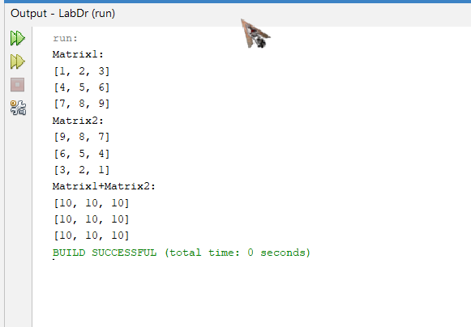
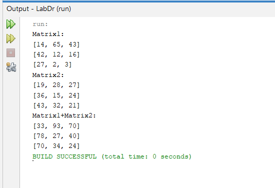

[](https://classroom.github.com/open-in-codespaces?assignment_repo_id=11016612)

# Практична робота "Поглиблене використання масивів"

## Основні вимоги до практичної роботи:

1. написати клас, який містить методи для розв'язання обраного вами завдання та тестовий клас, який дозволяє перевірити його роботу. Класи мають міститись у теці ```src```. Не забуваємо про те, що основний клас **має бути універсальним, тобто він не містить інтерфейсу користувача - лише логіку (статичний метод), яка диктується завданням** (і можливо не всі його методи мають бути публічними)!✅
2. методу ```main``` тестового класу **не може містити ніякої логіки, пов'язаної з виконанням завдання** - лише перевіряти працездатність основного класу!✅
3. **README.MD репозиторію має містити опис обраного вами завдання** (краще - з картинками та форматуванням :blush:)!✅
4. **УВАГА!** Не слід вважати, що завдання дуже прості! Вам необхідно подбати про:
    * **оптимізацію програми - обрати оптимальні з точки зору обсягу використовуваної пам'яті типи даних**✅
    * **іменування змінних і констант у відповідності до рекомендацій**✅
    * **javadoc-коментарі для основного класу, які пояснюють що саме обчислюється і які вихідні дані для цього потрібні**✅
5. завдання намагаємось виконувати **без циклів - з використанням класу ````Arrays````** (див. відеолекцію, та приклад, який я там розв'язав)✅

## Обране завдання: 7. Знайти суму двох матриць розміром N x M

**Код MatrixUtilsTest.java:**
````java
import java.util.Arrays;


 /**
 * The class Matrix utils test
 */ 
public class MatrixUtilsTest {

/** 
 *
 * Main
 *
 * @param args  the args. 
 */
    public static void main(String[] args) { 

        int[][] matrix1 = {{14, 65, 43}, {42, 12, 16}, {27, 2, 3}};
        int[][] matrix2 = {{19, 28, 27}, {36, 15, 24}, {43, 32, 21}};

        int[][] result = MatrixUtils.sum(matrix1, matrix2);
        System.out.println("Matrix1:");
        for (int[] row : matrix1){
        System.out.println(Arrays.toString(row));}
        System.out.println("Matrix2:");
        for (int[] row : matrix2){
        System.out.println(Arrays.toString(row));}
        System.out.println("Matrix1+Matrix2:");
        for (int[] row : result) {
            
            System.out.println(Arrays.toString(row));
        }
    }
}

````

**Код MatrixUtils.java:**
````java
import java.util.Arrays;
import java.util.function.IntFunction;


 /**
 * The class Matrix utils
 */ 
public class MatrixUtils {

/** 
 *
 * Sum
 *
 * @param matrix1  the matrix1. 
 * @param matrix2  the matrix2. 
 * @return int[][]
 */
    public static int[][] sum(int[][] matrix1, int[][] matrix2) { 

        int n = matrix1.length;
        int m = matrix1[0].length;
        int[][] result = new int[n][m];
        
        IntFunction<int[]> rowCreator = i -> new int[m];
        int[][] temp = new int[n][];
        Arrays.parallelSetAll(temp, rowCreator);
        
        IntFunction<int[]> rowCalculator = i -> {
            int[] row = temp[i];
            Arrays.setAll(row, j -> matrix1[i][j] + matrix2[i][j]);
            return row;
        };
        Arrays.parallelSetAll(result, rowCalculator);
        
        return result;
    }
}

````


## Результати роботи програми:


**з іншими значеннями в двох матрикях:**



